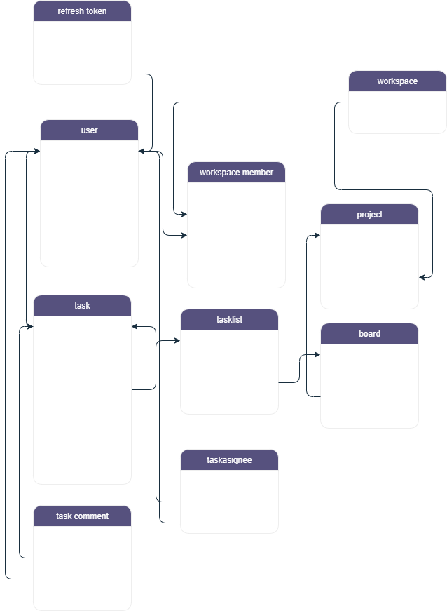

# TaskFlow - Modern Görev Yönetim Sistemi


## 📌 Genel Bakış
TaskFlow, Asana ve Trello benzeri modern bir görev yönetim sistemi olarak tasarlanmıştır. Spring Boot tabanlı bu uygulama, ekiplerin projelerini, görevlerini ve iş akışlarını verimli bir şekilde yönetmelerine olanak tanır.

## ✨ Özellikler
- **Çalışma Alanları (Workspaces)** ve **Projeler** ile hiyerarşik organizasyon
- **Board** ve **TaskList** yapıları ile görsel görev yönetimi
- Kullanıcı dostu görev atama sistemi (**Task Assignee**)
- Görev yorumları ile ekip iletişimi
- JWT tabanlı güvenli kimlik doğrulama
- Redis ile performans optimizasyonu
- Docker desteği ile kolay dağıtım

## 🛠 Teknolojiler
- **Backend**:
    - Spring Boot 3.x
    - Spring Data JPA
    - Spring Security
    - Spring Validation
    - Spring Actuator
    - Spring Modulith (Modüler yapı)
- **Database**: PostgreSQL
- **Cache**: Redis
- **Containerization**: Docker
- **Authentication**: JWT (java-jwt)
- **Diğer**:
    - MapStruct (DTO mapping)
    - AOP (Aspect Oriented Programming)
    - Lombok

## 🗄 Veritabanı Şeması


## 🚀 Kurulum

### Seçenek 1: Docker ile Hızlı Başlangıç (Önerilen)

1. Docker ve Docker Compose'un kurulu olduğundan emin olun
2. Projeyi klonlayın:
   ```bash
   git clone https://github.com/yigitucun/taskflow.git
   cd taskflow
   ./gradlew clean bootJar
    docker-compose up --build

3. Uygulama Adresleri

API: http://localhost:8080

PostgreSQL: localhost:5433 (kullanıcı: postgres, şifre: root)

Redis: localhost:6379

## 📚 API Dokümantasyonu

Projede REST API'lerin kullanımı ve test edilmesi için Swagger UI entegre edilmiştir.

### Swagger UI'yi Kullanma

Uygulamayı çalıştırdıktan sonra aşağıdaki adrese giderek API dökümantasyonunu görüntüleyebilir ve test edebilirsiniz:

http://localhost:8080/swagger-ui.html

## 🔒 Kimlik Doğrulama
JWT token üzerinden yapılır. Giriş yaptıktan sonra Authorization: Bearer <token> başlığı ile istek atmalısınız.
